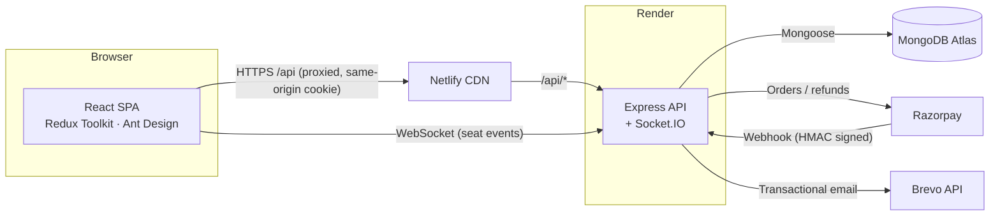
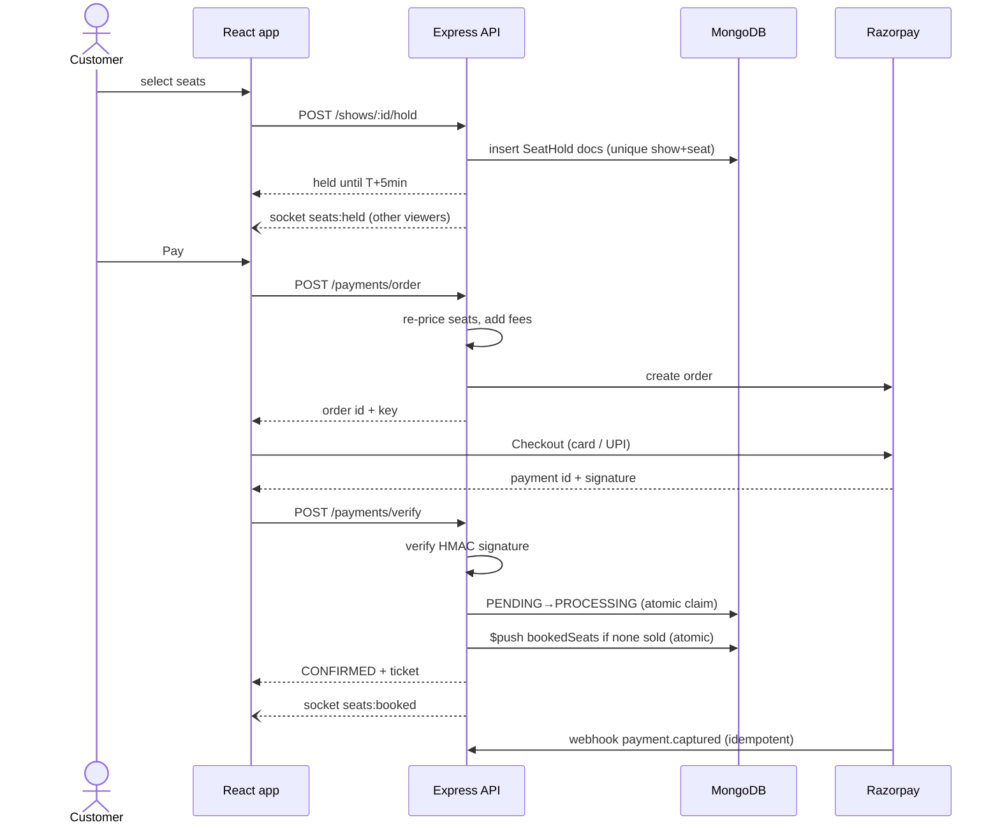

# BookMyShow — MERN Movie Ticket Booking Platform

A full-stack movie ticket booking platform built with **MongoDB, Express, React and Node.js**.
Customers browse movies, pick a showtime, choose seats on a live seat map and pay with
**Razorpay**; theatre partners list their cinemas and schedule shows; administrators curate
the catalogue and approve theatres.

Built as the applied capstone project for the Scaler Neovarsity – Woolf MSc in Computer Science.

| | |
| --- | --- |
| **Live app** | _added after deployment_ |
| **API health** | _added after deployment_ |
| **API docs** | `/api/docs` (Swagger UI) · `/api/docs.json` (OpenAPI 3) |
| **Stack** | React 19 · Vite · Redux Toolkit · Ant Design · Node 22 · Express 4 · MongoDB / Mongoose · Socket.IO · Razorpay · Brevo |

---

## Highlights

- **Real-time seat map** — seats held or sold by other customers appear instantly via Socket.IO rooms per show.
- **No double booking** — seat holds use a unique `(show, seat)` index; final booking is a single conditional
  `$push` that only succeeds if none of the seats are sold. A concurrency test races five customers for one seat.
- **Trustworthy payments** — prices are computed on the server, Razorpay signatures are verified with HMAC-SHA256,
  confirmation is idempotent (browser callback and webhook can both arrive) and customers are refunded automatically
  if seats are lost between payment and confirmation.
- **Signed e-tickets** — QR codes carry an HMAC-signed booking id; partners admit each ticket exactly once at the gate.
- **Cancellations and refunds** — tiered refund policy (100% / 75%), atomic status change so a refund can never be issued twice.
- **Verified reviews** — only customers who attended a show can rate the movie; ratings are denormalised for fast listings.
- **Role-based workflows** — customer, theatre partner (with admin approval) and administrator dashboards with analytics.
- **Security** — bcrypt (12 rounds), httpOnly JWT cookie, zod validation on every route, helmet, tiered rate limits,
  NoSQL-operator sanitisation, OTP password reset with attempt limits.
- **Tested** — 60+ API tests (Jest + Supertest + in-memory MongoDB) run in GitHub Actions on every push.

## Features by role

| Customer | Theatre partner | Administrator |
| --- | --- | --- |
| Register / log in, reset password by email OTP | Register theatres (pending approval) | Add, edit, deactivate movies |
| Search, filter by genre / language, now showing & coming soon | Schedule shows with screen, format, language and price tiers | Approve or block theatres with a reason |
| City-aware showtimes for the next 7 days | Overlap detection per screen; re-price after sales | Activate / deactivate users |
| Live seat map, 5-minute seat hold with countdown | Revenue, tickets and occupancy dashboard | Platform KPIs, revenue trend, top movies |
| Razorpay checkout, e-ticket with QR, email confirmation | Bookings per show, camera QR / code check-in | |
| Cancel with refund, rate & review watched movies | | |

## Architecture



### Booking flow



## Project structure

```
bookmyshow/
├── server/                    Express API
│   ├── src/
│   │   ├── config/            env + MongoDB connection
│   │   ├── models/            User, Movie, Theatre, Show, SeatHold, Booking, Review
│   │   ├── validators/        zod schemas per resource
│   │   ├── middleware/        auth (JWT + roles), validation, security, errors
│   │   ├── services/          seats, booking, payment, cancellation, review, ticket, email, analytics
│   │   ├── controllers/       thin HTTP handlers
│   │   ├── routes/            REST routers mounted under /api
│   │   ├── sockets/           Socket.IO rooms per show
│   │   ├── app.js             Express app (no listen, used by tests)
│   │   └── server.js          HTTP + Socket.IO bootstrap
│   ├── scripts/               seed data, in-memory dev server
│   └── tests/                 Jest + Supertest suites
├── client/                    React SPA (Vite)
│   ├── public/posters/        generated SVG posters for demo movies
│   └── src/
│       ├── api/               axios client + resource wrappers
│       ├── store/             Redux Toolkit slices (auth, ui)
│       ├── components/        layout, seat map, ticket, charts …
│       ├── hooks/             useAsync, useShowSocket
│       └── pages/             catalogue, booking, auth, partner/, admin/
├── render.yaml                Render blueprint (API)
├── netlify.toml               Netlify build + /api proxy (client)
└── .github/workflows/ci.yml   CI pipeline
```

## Getting started

### Prerequisites

- Node.js 22+
- A MongoDB connection string (MongoDB Atlas free tier) — optional for local development

### Quick start (no database needed)

```bash
# terminal 1 — API with an in-memory MongoDB, seeded with demo data
cd server
npm install
npm run dev:memory

# terminal 2 — React app on http://localhost:5173
cd client
npm install
npm run dev
```

### With MongoDB Atlas

```bash
cd server
cp .env.example .env        # set MONGO_URI and JWT_SECRET
npm run seed                # optional: load demo data (wipes the app collections)
npm run dev
```

Without Razorpay keys the API runs a clearly labelled **simulated checkout** so the whole flow can be
exercised locally. Without a Brevo key, emails (OTP codes, tickets) are printed to the API console.

### Demo accounts (after seeding)

| Role | Email | Password |
| --- | --- | --- |
| Administrator | admin@bookmyshow.dev | Admin@123 |
| Theatre partner | partner@bookmyshow.dev | Partner@123 |
| Customer | user@bookmyshow.dev | User@1234 |

Razorpay test card: `4111 1111 1111 1111`, any future expiry, any CVV; or UPI id `success@razorpay`.

## Environment variables

**server/.env** — see [`server/.env.example`](server/.env.example)

| Variable | Purpose |
| --- | --- |
| `MONGO_URI` | MongoDB connection string |
| `JWT_SECRET` / `JWT_EXPIRES_IN` | Signing secret and lifetime of the auth token |
| `CLIENT_URL` | Comma-separated allowed origins for CORS and Socket.IO |
| `TRUST_PROXY` | Proxy hops in front of the API (1 on Render) |
| `RAZORPAY_KEY_ID` / `RAZORPAY_KEY_SECRET` | Razorpay API keys (test mode) |
| `RAZORPAY_WEBHOOK_SECRET` | Secret configured on the Razorpay webhook |
| `BREVO_API_KEY` / `EMAIL_FROM` | Transactional email |
| `TICKET_SECRET` | HMAC key for QR tickets |

**client/.env** — `VITE_API_URL` (defaults to `/api`), `VITE_SOCKET_URL` (API origin in production).

## API reference

All endpoints are prefixed with `/api`. 🔒 = login required.

| Area | Endpoints |
| --- | --- |
| Auth | `POST /auth/register` · `POST /auth/login` · `POST /auth/logout` · `GET/PATCH /auth/me` 🔒 · `PATCH /auth/password` 🔒 · `POST /auth/forgot-password` · `POST /auth/reset-password` |
| Movies | `GET /movies` · `GET /movies/filters` · `GET /movies/:id` · `POST/PATCH/DELETE /movies/:id` 🔒 admin |
| Reviews | `GET /movies/:id/reviews` · `PUT/DELETE /movies/:id/reviews` 🔒 (watched the movie) |
| Theatres | `GET /theatres/cities` · `GET /theatres/mine` · `POST/PATCH/DELETE /theatres/:id` 🔒 partner |
| Shows | `GET /shows/movie/:movieId?date&city` · `GET /shows/:id` · `GET /shows/:id/seats` · `POST/DELETE /shows/:id/hold` 🔒 · `GET /shows/mine` · `POST/PATCH/DELETE /shows/:id` 🔒 partner |
| Payments | `GET /payments/config` · `POST /payments/order` 🔒 · `POST /payments/verify` 🔒 · `POST /payments/cancel` 🔒 · `POST /payments/webhook` (Razorpay, HMAC) |
| Bookings | `GET /bookings/me` 🔒 · `GET /bookings/:id` 🔒 · `POST /bookings/:id/cancel` 🔒 |
| Partner | `GET /partner/stats` · `GET /partner/bookings` · `POST /partner/checkin` 🔒 partner |
| Admin | `GET /admin/stats` · `GET /admin/users` · `PATCH /admin/users/:id/status` · `GET /admin/theatres` · `PATCH /admin/theatres/:id/status` 🔒 admin |

Socket.IO: clients emit `show:join` / `show:leave` with a show id and receive `seats:held`,
`seats:released` and `seats:booked`.

## Testing

```bash
cd server && npm test          # API tests against an in-memory MongoDB
cd client && npm run lint && npm run build
```

The suites cover authentication, role checks, catalogue filters, theatre approval, show overlap rules,
concurrent seat holds, payment verification and idempotency, refunds on lost seats, webhooks, OTP reset,
ticket emails, dashboards, check-in and security headers / rate limits / injection attempts.

## Deployment

| Piece | Platform | Notes |
| --- | --- | --- |
| Database | MongoDB Atlas (M0) | Network access must allow Render (0.0.0.0/0 on the free tier) |
| API | Render web service | `render.yaml` blueprint; health check `/api/health` |
| Client | Netlify | `netlify.toml`; proxies `/api/*` to Render; set `VITE_SOCKET_URL` |
| Payments | Razorpay test mode | Webhook URL `https://<render-app>/api/payments/webhook`, events `payment.captured`, `order.paid`, `payment.failed` |

The free Render instance sleeps after inactivity; the first request after a pause can take ~50 seconds.

## License

Released for educational purposes.
